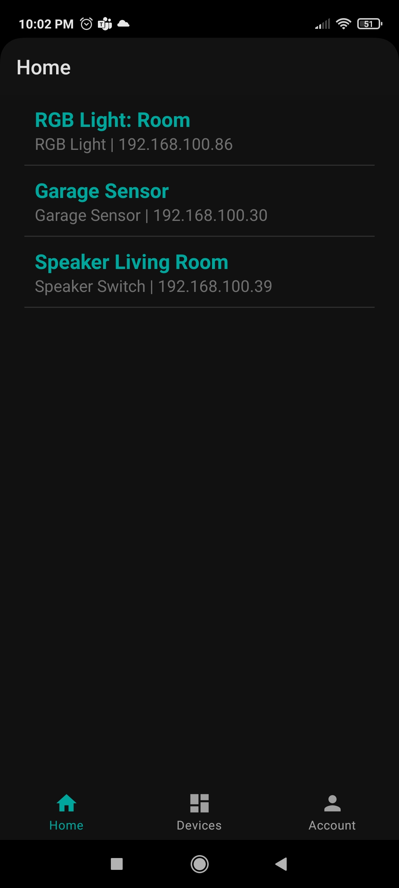
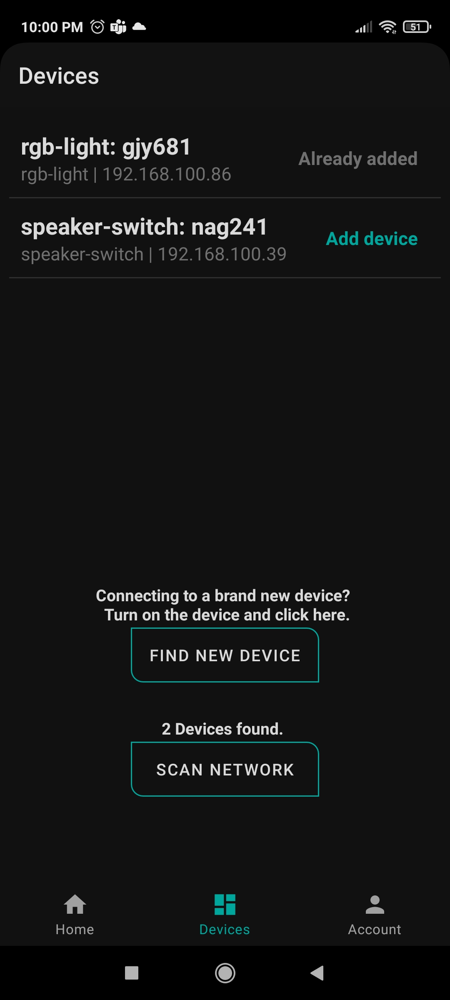

# Zarus Iot Hub (Android App)

Zarus IoT Hub is an open source application to facilitate the discovery and connections to the iot devices developed by Zarus and its derived codes using the [Network Controller](https://github.com/AndresDuran53/zarus-network-controller) library.
 For example to connect and use the [LED RGB Controller](https://github.com/AndresDuran53/zarus-rgb-controller/) with a simple UI.

## Screenshots

## Quick Start
1. Download the Zarus IoT Hub application and open it.
2. Go to the *Devices* tab and click on *Find new device*.
3. Click on the device that you want to configure and wait until your phone connects.
4. Insert the name and password of your Home Wi-Fi, and click *Save configuration*.
5. Connect your phone again to your Home Wi-Fi and click *Refresh*.
6. Click *Scan network* and click the device that you want to add.
7. Now you can go to the *Home* tab and click the device to start using you new device.

## To-Do
- [ ] Check WiFi AP strength before show in list.
- [ ] Adding confirmation before delete device
- [ ] Adding LogIn functionality
- [ ] Adding Compatibility with Tasmota

## License

Zarus IoT is an open source app. All files are licenced under Creatie Commons [Reconocimiento-NoComercial-CompartirIgual 4.0 Internacional](https://creativecommons.org/licenses/by-nc-sa/4.0/deed.es)

This software use the [AndroidNetworkTools](https://github.com/stealthcopter/AndroidNetworkTools) library by [stealthcopter](https://github.com/stealthcopter) without any modification under the license [Apache License 2.0](https://www.apache.org/licenses/LICENSE-2.0)
